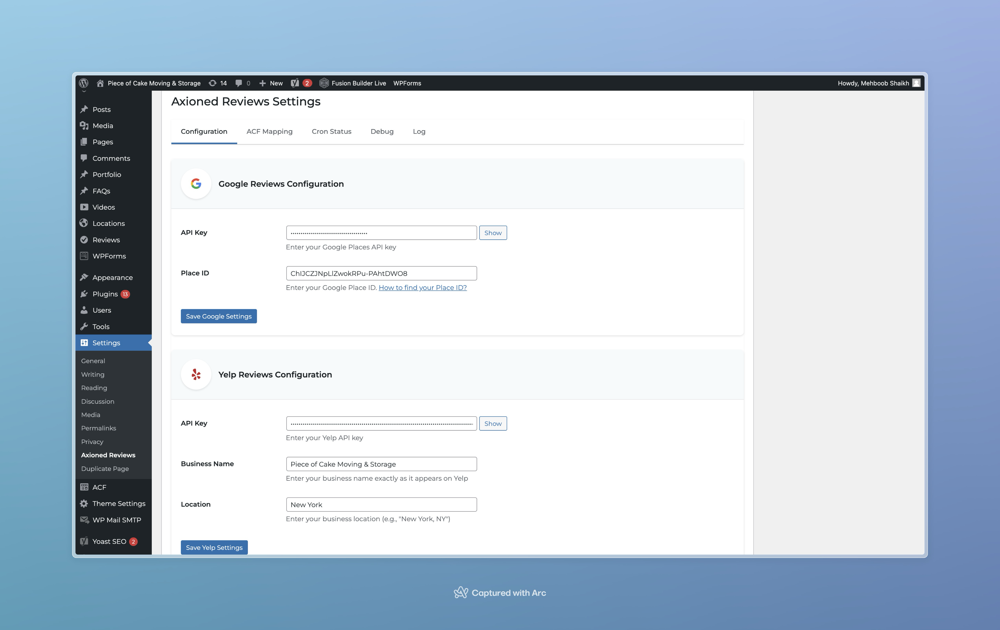
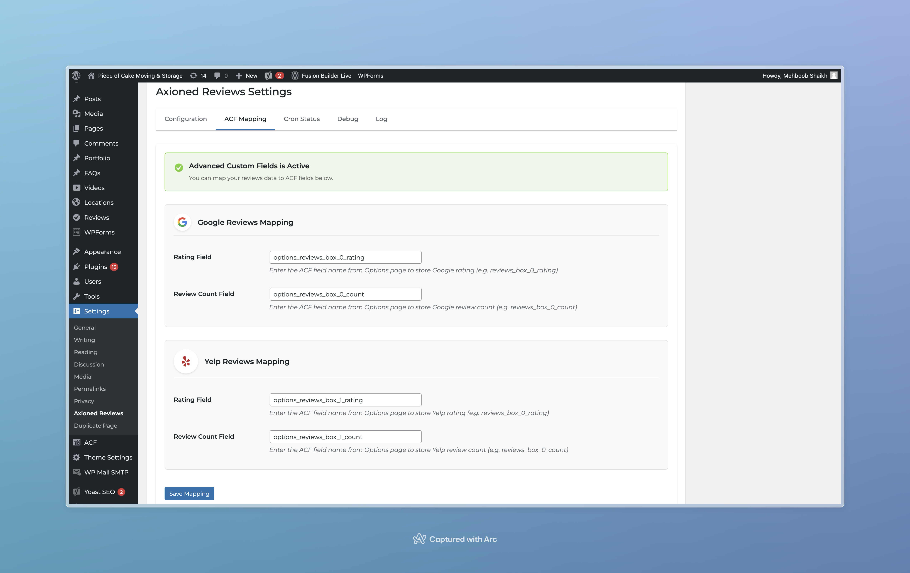
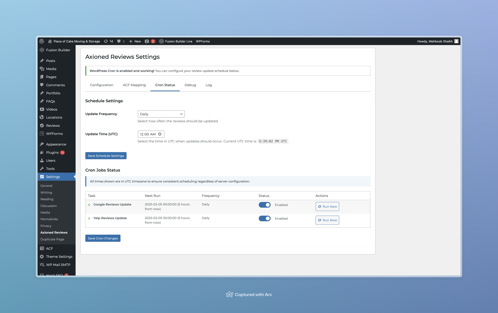
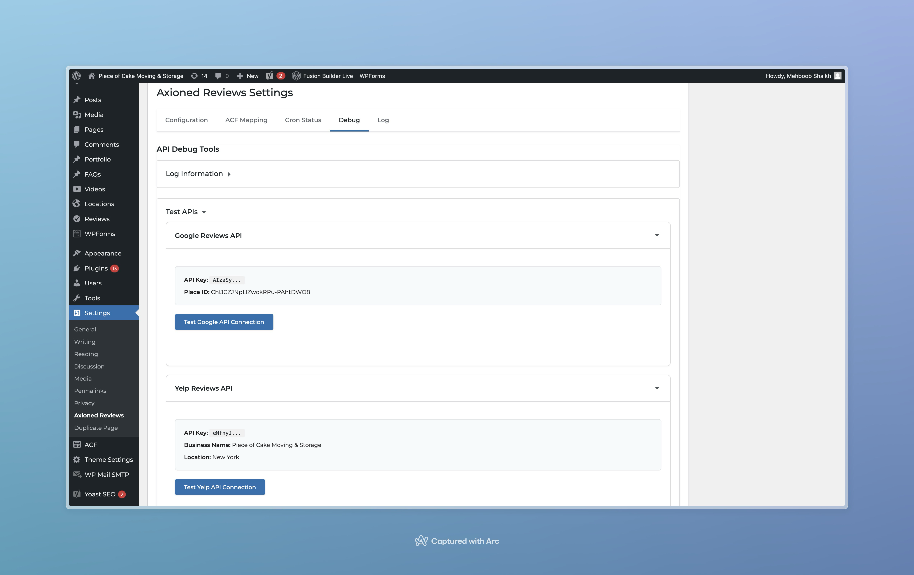
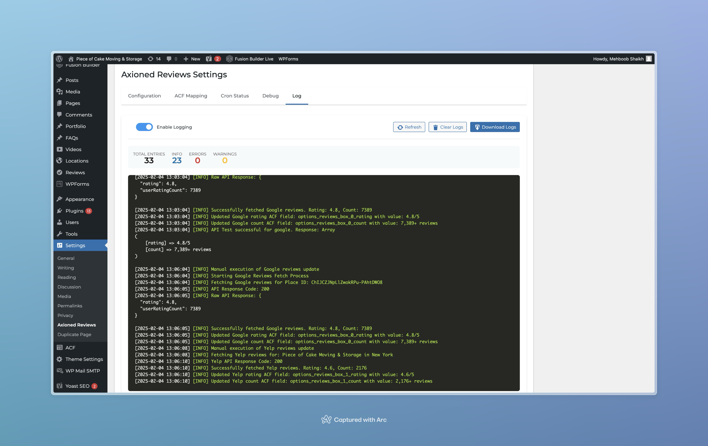

# Axioned Automated Reviews

Automatically fetch and display Google Places and Yelp reviews in WordPress using ACF.

## Overview

This plugin fetches reviews from Google Places and Yelp APIs, storing them in WordPress options. It uses ACF for field mapping and WordPress cron for automated updates.

## Technical Requirements

- WordPress 5.0+
- PHP 7.4+
- Advanced Custom Fields (ACF) Pro
- Google Places API key
- Yelp API key
- SSL certificate (for API security)

## Installation & Setup

### 1. Plugin Installation
- Download and extract to `wp-content/plugins/axioned-automated-reviews/`
- Activate plugin through WordPress admin

### 2. API Setup

#### Google Places API
1. Visit Google Cloud Console
2. Enable Places API
3. Create credentials
4. Get your Place ID:
   - Use [Google's Place ID Finder](https://developers.google.com/maps/documentation/places/web-service/place-id)
   - Or search your business on Google Maps and get ID from URL

#### Yelp API
1. Visit [Yelp Fusion](https://www.yelp.com/developers/v3/manage_app)
2. Create New App
3. Get API Key
4. Note your exact business name and location

### 3. WordPress Configuration

1. Go to "Axioned Reviews Settings"
2. Configure in this order:
   - Enter API keys in Configuration tab
   - Map ACF fields in ACF Mapping tab
   - Test APIs in Debug tab
   - Monitor in Cron Status tab

### 4. ACF Field Setup

1. Create ACF Options Page
2. Add fields for:
   - Google Rating (Text)
   - Google Review Count (Text)
   - Yelp Rating (Text)
   - Yelp Review Count (Text)
3. Note the field names for mapping

## Technical Details

### Data Flow
1. API Request triggered (cron/manual)
2. Fetch data from APIs
3. Format values (e.g., "4.8/5", "2,175+ reviews")
4. Update WordPress options
5. Available in ACF fields

### Cron Jobs
- Schedule: Every 12 hours
- Hooks: 
  - `axioned_update_google_reviews`
  - `axioned_update_yelp_reviews`

### API Responses

#### Google Places
### API Responses

#### Google Places
```json
{
  "rating": 4.8,
  "userRatingCount": 2175
}
```

#### Yelp
```json
{
  "businesses": [{
    "rating": 4.6,
    "review_count": 213
  }]
}
```

### Usage
```php
// Get formatted ratings
$google_rating = get_option('your_google_rating_field'); // Returns "4.8/5"
$google_count = get_option('your_google_count_field'); // Returns "2,175+ reviews"
// Get Yelp ratings
$yelp_rating = get_option('your_yelp_rating_field'); // Returns "4.6/5"
$yelp_count = get_option('your_yelp_count_field'); // Returns "213+ reviews"
```

### Update
```php
// Trigger manual updates from code
do_action('axioned_update_google_reviews');
do_action('axioned_update_yelp_reviews');
```

### Folder Structure
```markdown
axioned-automated-reviews/
├── axioned-automated-reviews.php # Plugin initialization
├── includes/
│ ├── admin/
│ │ ├── class-admin.php # Admin UI & settings
│ │ ├── css/
│ │ │ └── admin-styles.php # Admin styles
│ │ └── tabs/ # Settings tabs
│ ├── google/
│ │ ├── google-fetch.php # Google API handler
│ │ └── google-cron-job.php # Scheduled tasks
│ └── yelp/
│ ├── yelp-fetch.php # Yelp API handler
│ └── yelp-cron-job.php # Scheduled tasks
└── logs/ # Debug logs
```
## Debugging

### Log Location
- Debug logs are stored in: `wp-content/uploads/axioned-reviews-logs/debug.log`
- Enable logging in Debug tab
- View logs in Log tab

### Common Issues

1. API Key Invalid
   - Check key permissions
   - Verify SSL certificate
   - Test in Debug tab

2. Cron Not Running
   - Check WP Cron status in Cron Status tab
   - Verify server timezone
   - Check error logs

3. ACF Fields Not Updating
   - Verify field names in ACF Mapping tab
   - Check API responses in Debug tab
   - Enable debug logging

## Support

- Email: mehboobs@axioned.com
- Report issues: [GitHub Issues](https://github.com/smehboobaxioned/wp-poc-review-automation-plugin/issues)

## License

GPL v2 or later

Developed by Axioned

## Screenshots

### Configuration Tab

*Configure Google Places and Yelp API settings*

### ACF Mapping Tab

*Map your ACF fields to store review data*

### Cron Status Tab

*Monitor and manually trigger review updates*

### Debug Tab

*Test API connections and view responses*

### Logs Tab

*View detailed plugin activity logs*
